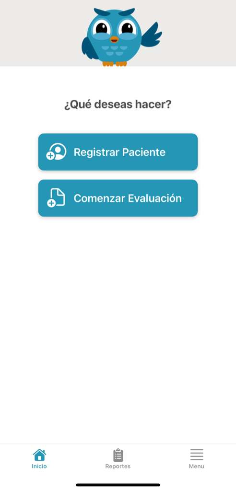
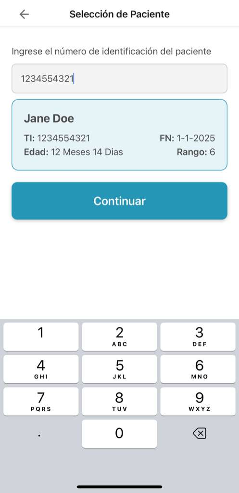
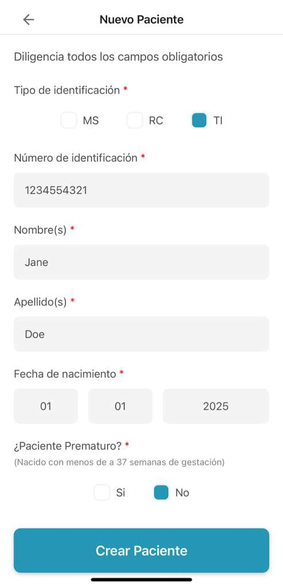
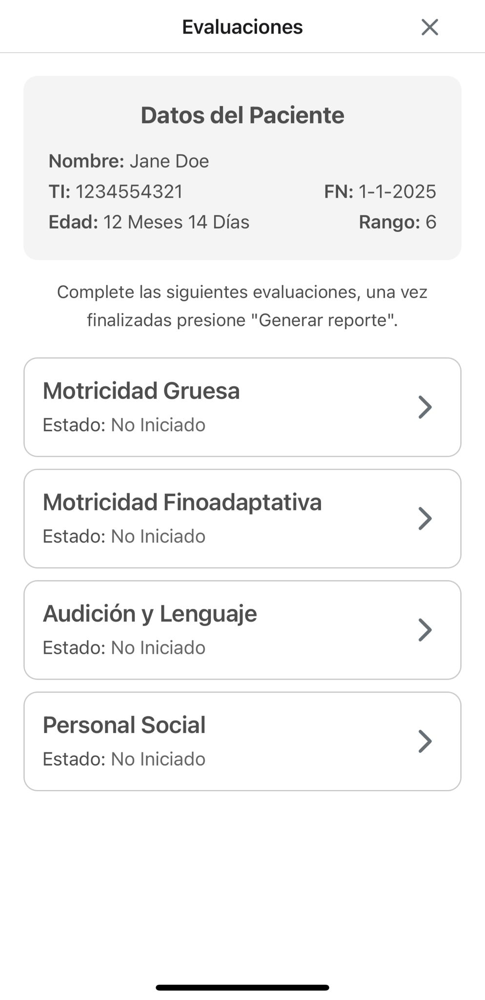
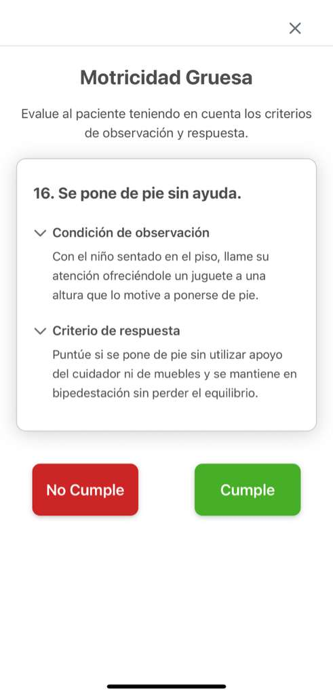
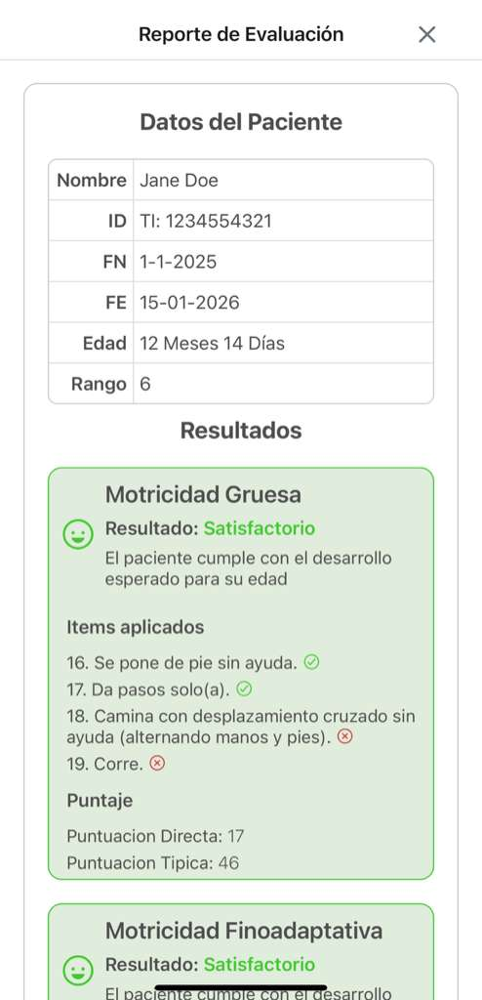

# EAD3 App - Child Development Screening Tool

A cross-platform application for screening child development using the Abbreviated Developmental Scale-3 (EAD3 - Escala Abreviada de Desarrollo 3). https://www.minsalud.gov.co/sites/rid/Lists/BibliotecaDigital/RIDE/VS/PP/ENT/Escala-abreviada-de-desarrollo-3.pdf

## Overview

EAD3 App is designed to streamline the assessment of child development for healthcare professionals. The application automates the screening process using the Abbreviated Developmental Scale-3 (Escala Abreviada de Desarrollo-3), allowing practitioners to focus on evaluation rather than manual calculations.

## Key Features

- **Age-Adaptive Assessments**: Automatically presents questions relevant to the child's age, ensuring appropriate screening
- **Intelligent Question Management**: Maintains proper indexing and consistency throughout the assessment
- **Automated Result Calculation**: Computes developmental scores instantly without manual calculations
- **Intuitive User Interface**: Streamlined design for healthcare professionals to conduct evaluations efficiently
- **Cross-Platform Support**: Built with Expo, works seamlessly on iOS, Android, and web platforms
- **PDF Report Generation**: Export evaluation results as professional PDF reports
- **User Management**: Store and manage multiple patient evaluations
- **Data Persistence**: Save evaluations for future reference and tracking

## Screenshots

<div style="display: flex; flex-wrap: wrap; gap: 10px; justify-content: center;">
  
  
  
</div>

<div style="display: flex; flex-wrap: wrap; gap: 10px; justify-content: center;">
  
  
  
</div>

## Technology Stack

- **Framework**: React Native with Expo
- **Language**: TypeScript
- **UI Components**: Custom themed components with light/dark mode support
- **Styling**: Native platform-specific styles

## Project Structure

```
app/                          # Application screens and routes
├── (session)/               # Authentication and user flows
├── (tabs)/                  # Main application tabs
assets/
├── data/                    # Assessment data and questions
└── images/                  # Application images
components/                 # Reusable UI components
constants/                  # Theme and configuration
hooks/                      # Custom React hooks
utils/                      # Utility functions
  ├── calculate-userdata.ts  # Score calculations
  ├── evaluationFunctions.ts # Evaluation logic
  └── exportPDF.ts          # PDF report generation
```

## Getting Started

### Prerequisites

- Node.js 16 or higher
- npm or yarn
- Expo CLI

### Installation

1. Install dependencies:

   ```bash
   npm install
   ```

2. Install Expo dependencies:
   ```bash
   npx expo install
   ```

### Running the App

Start the development server:

```bash
npx expo start
```

Then select one of the following options:

- Press `i` to open in iOS Simulator
- Press `a` to open in Android Emulator
- Press `w` to open in web browser
- Scan QR code with Expo Go app on your mobile device

## Usage

1. **Create User Profile**: Add a new patient with relevant personal information
2. **Select Assessment**: Choose "Iniciar Nueva Evaluacion" and search for the patient ID
3. **Complete Assessment**: Choose each area of evaluation and answer screening questions as you evaluate the child. Once completed the 4 evaluation types click on generate report
4. **Review Results**: Automatically generated developmental scores and classifications
5. **Generate Report**: Export results as a PDF for medical records

## Features in Detail

### Adaptive Assessment Logic

The app intelligently determines which questions to present based on the child's age, following the EAD3 protocol standards.

### Automatic Scoring

Real-time calculation of developmental indices and classifications, eliminating manual arithmetic errors and saving time.

### Report Generation

Professional PDF reports that include:

- Patient information
- Assessment date and scores
- Developmental classification
- Clinical interpretation

## License

This project is proprietary and intended for medical professionals conducting child development screenings.

## Support

For support and questions, please contact me

---

**Disclaimer**: This application is designed to assist healthcare professionals in screening child development. It should be used in conjunction with clinical judgment and cannot replace professional medical evaluation.
